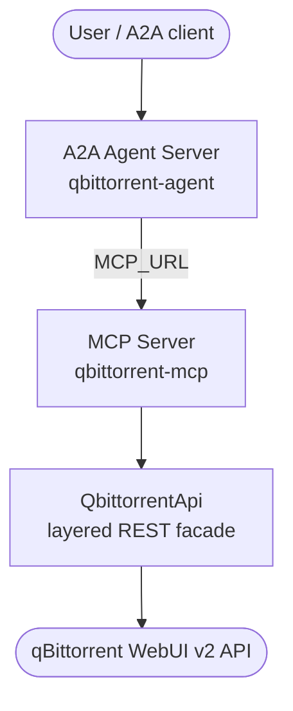
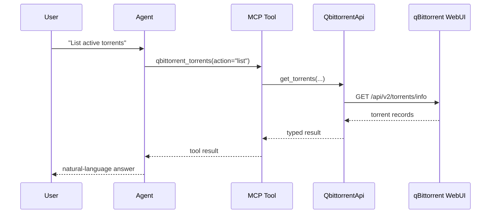

# Architecture

`qbittorrent-agent` follows the standardized agent-package pattern: a layered REST
client, a thin MCP tool surface, and an optional A2A agent server — all built on
`agent-utilities`.

## Components

- **A2A agent server** (`qbittorrent_agent/agent_server.py`) — a Pydantic-AI agent
  built with `create_agent_server`. It auto-discovers the MCP tool surface from
  `mcp_config.json` and serves an A2A / AG-UI endpoint.
- **MCP server** (`qbittorrent_agent/mcp_server.py`) — registers seven
  action-dispatch tools, one per WebUI domain, each gated by an environment switch.
  The tool wrappers carry no business logic.
- **`QbittorrentApi`** (`qbittorrent_agent/api/`) — a session-authenticated REST
  facade composed from per-domain sub-clients (`api_client_app`, `api_client_log`,
  `api_client_sync`, `api_client_transfer`, `api_client_torrents`, `api_client_rss`,
  `api_client_search`) over a shared `BaseApiClient`.

## Request flow

## Layered client

`BaseApiClient` owns authentication (the WebUI SID cookie), the shared `requests`
session, and TLS verification. Each domain sub-client adds its own typed read and
control methods, and the unified `QbittorrentApi` composes them through multiple
inheritance. `get_client()` in `qbittorrent_agent/auth.py` builds the unified client
from the `QBITTORRENT_*` environment variables and surfaces credential failures as a
clear `RuntimeError`.
